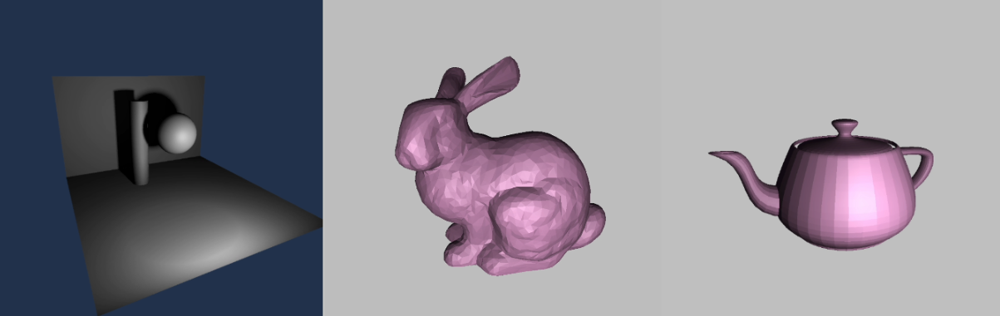

# zig-graphics-test



Simple 3D graphics test I made to learn Zig and OpenGL following the [OpenGL Tutorial](http://www.opengl-tutorial.org/).

This uses, [zalgebra](https://github.com/kooparse/zalgebra), [zigglgen](https://github.com/castholm/zigglgen), and [zglfw](https://github.com/IridescenceTech/zglfw)

## Requirements

- zig 0.13.0 (?)
- glfw

## Usage

Supports basic obj files and loading DDS and BMP textures.

```
// zig build run -- <path to obj file> <path to texture (optional)>
zig build run -- test/room.obj test/lightmap.DDS
```
